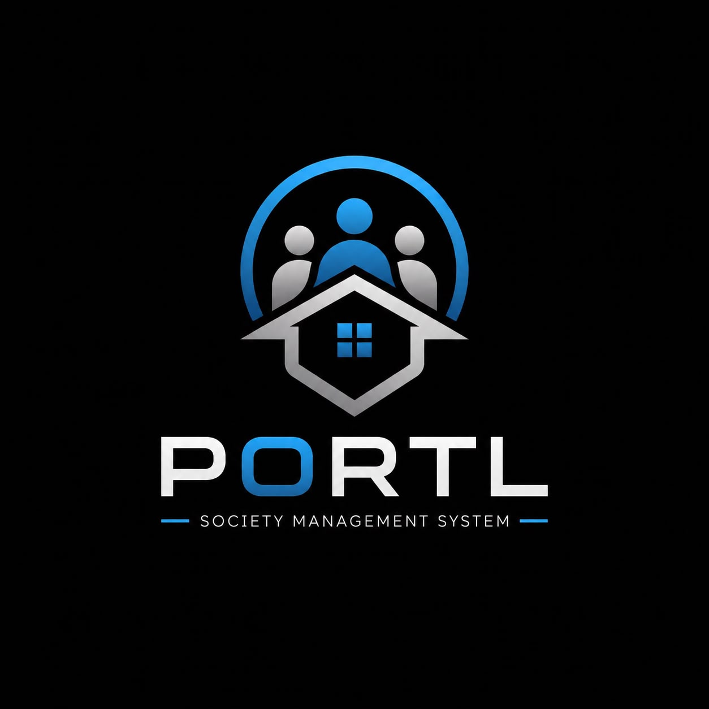

<div align="center">
  

  # Portl — The Unified Society OS

  **Next-Generation, Real-Time Community Management for Modern Residential Complexes.**

  [](https://reactnative.dev/)
  [](https://expo.dev/)
  [](https://supabase.com/)
  [](https://tailwindcss.com/)
  [](https://www.typescriptlang.org/)

  ### 🎥 [Watch the 15-Second Demo Video on YouTube!](https://youtube.com/shorts/SnUTamrEA0o?is=OwEFym2d6tW9Dh36)

</div>

<br />

---

## 📖 Table of Contents
1. [Overview & Elevator Pitch](#-overview--elevator-pitch)
2. [The Problem We Solve](#-the-problem-we-solve)
3. [Key Features by Role](#-key-features-by-role)
   - [Resident Experience](#resident-experience)
   - [Guard Experience](#guard-experience)
   - [Admin Experience](#admin-experience)
4. [Technical Architecture](#-technical-architecture)
   - [Frontend Ecosystem](#frontend-ecosystem)
   - [Backend Ecosystem (Supabase)](#backend-ecosystem-supabase)
5. [Database Schema & Security (RLS)](#-database-schema--security-rls)
6. [Folder Structure](#-folder-structure)
7. [Comprehensive Setup Guide](#-comprehensive-setup-guide)
8. [Demo Credentials](#-demo-credentials)
9. [Testing the Core Loop](#-testing-the-core-loop)
10. [Future Roadmap](#-future-roadmap)
11. [License](#-license)

---

## 🚀 Overview & Elevator Pitch

**Portl** is a comprehensive, native-feeling Society Management OS built specifically to solve the fragmentation problem in modern residential complexes. 

Instead of forcing residents to use one app, security guards to use a clunky tablet interface, and admins to use a web portal, **Portl unifies all three roles into a single, seamless, extremely fast React Native application.** 

Powered by **Supabase Realtime WebSockets** and secured by strict **Row Level Security (RLS)**, Portl delivers instantaneous data synchronization. When a guard scans a visitor at the gate, the resident's phone updates in milliseconds—no refreshing required.

---

## 🎯 The Problem We Solve

1. **Fragmented Ecosystems**: Most societies use disparate tools (WhatsApp for notices, a legacy app for visitors, paper logs for staff). Portl brings everything under one roof.
2. **Slow Gate Clearances**: Traditional apps rely on slow polling or delayed push notifications. By utilizing WebSockets, Portl achieves sub-second gate clearances, eliminating traffic jams at the society gate.
3. **Lack of Trust in Service Staff**: Residents often don't know which maids, plumbers, or drivers are verified. Portl introduces a "Trusted Staff" directory curated by admins and personalized by residents.
4. **Poor User Experience**: Society apps are notoriously ugly and slow. Portl is built with NativeWind, Expo Haptics, and optimistic UI updates to feel like a premium, 1st-party iOS/Android application.

---

## ✨ Key Features by Role

Portl dynamically routes users to their specific interface based on their database role. A single unified codebase powers three entirely distinct experiences.

### Resident Experience
- **Real-Time Visitor Approval**: Get instant, push-like notifications when a visitor is at the gate. Approve or reject with a single tap (complete with satisfying haptic feedback).
- **Community Hub**:
  - **Notices**: Read important updates from the society admin.
  - **Polls**: Participate in democratic society decisions with live-updating percentage bars.
  - **Complaints**: Submit maintenance tickets, track their status (Pending, Resolved), and view resolutions.
  - **Amenities**: Book the clubhouse, gym, or tennis court. Built-in logic prevents double-booking.
- **Trusted Staff Directory**: View admin-verified service providers. Mark specific staff members as "Trusted" to automatically streamline their future gate entries.

### Guard Experience
- **Lightning-Fast Entry Logging**: Create a visitor request with a few taps. The UI immediately transitions to a "Waiting for Approval" state that updates the *millisecond* the resident responds.
- **Check-In / Check-Out**: Toggle the physical presence of visitors within the society. 
- **QR Code Scanning**: (Future-proofed UI) Quickly scan pre-approved visitor passes to eliminate manual data entry.
- **Status Indicators**: Color-coded badges instantly tell the guard if a visitor is `pending`, `approved`, `rejected`, or `checked_in`.

### Admin Experience
- **Master Dashboard**: A bird's-eye view of the society. Live metrics for Total Visitors, Open Complaints, Active Polls, and Amenity Bookings.
- **Society Operations**:
  - Resolve Resident Complaints with one tap.
  - Manage the Staff Directory (Add/Remove verified service providers).
  - Create global Notices and multi-option Polls.
- **Data Isolation**: Admins can securely view all tower and flat data, guaranteed by strict PostgreSQL RLS policies that prevent standard residents from viewing this sensitive information.

---

## 🏗️ Technical Architecture

### Frontend Ecosystem
- **Framework**: [React Native](https://reactnative.dev/) via [Expo (SDK 54)](https://expo.dev/)
- **Routing**: [Expo Router (v3)](https://docs.expo.dev/router/introduction/) for file-based, deep-linkable navigation.
- **Styling**: [NativeWind](https://www.nativewind.dev/) brings Tailwind CSS directly to React Native, allowing for rapid, responsive, and consistent UI design.
- **Icons**: [Lucide React Native](https://lucide.dev/) for crisp, scalable vector iconography.
- **Micro-Interactions**: `expo-haptics` is deeply integrated to provide physical feedback for critical actions (approving visitors, resolving complaints, logging check-ins).
- **State Management**: React Context (`AuthProvider`) combined with Supabase's real-time event listeners.

### Backend Ecosystem (Supabase)
Portl does not use a traditional Node.js/Express backend. Instead, it relies on the immense power of **Supabase**, utilizing PostgreSQL as a true backend-as-a-service.

- **Authentication**: Supabase Auth (OTP via SMS). Users log in using their phone numbers. The Auth context dynamically fetches their profile role and strictly routes them to the correct dashboard.
- **Realtime WebSockets**: Using `supabase.channel()`, the frontend subscribes to PostgreSQL `INSERT` and `UPDATE` events. This is how the Guard and Resident screens stay perfectly synced without API polling.
- **Row Level Security (RLS)**: The most critical architectural decision. Every single table in the database has strict RLS policies. 
  - *Example*: A Resident can only `SELECT` visitor requests where `flat_id = their_own_flat_id`.
  - *Example*: An Admin can `SELECT` all visitor requests.
  - This ensures that even if a malicious user reverse-engineers the API keys, they cannot access data belonging to other flats.

---

## 🗄️ Database Schema & Security (RLS)

Portl uses a highly relational PostgreSQL database. Here is the comprehensive breakdown of the core schema:

### 1. Core Infrastructure
| Table | Description |
| :--- | :--- |
| `societies` | The root entity. Contains society name and address. |
| `towers` | Belongs to a society. Represents physical buildings (e.g., "Tower A"). |
| `flats` | Belongs to a tower. Represents individual apartments (e.g., "Flat 402"). |

### 2. Identity & Access
| Table | Description |
| :--- | :--- |
| `auth.users` | Supabase's internal auth table (managed automatically). |
| `profiles` | 1-to-1 mapping with `auth.users`. Stores `role` (admin/guard/resident), `phone`, `full_name`, and `flat_id`. |
| `invites` | Pre-created by Admins. When a new user logs in via OTP, a PostgreSQL Database Trigger automatically looks up their phone number in this table and converts the invite into a full `profile`. |

### 3. Community Modules
| Table | Description |
| :--- | :--- |
| `visitor_requests` | The core engine. Tracks visitor `name`, `status` (pending/approved/rejected), `guard_id`, and `resident_id`. Fully Realtime enabled. |
| `notices` | Global announcements broadcasted by the Admin. |
| `polls` | Allows admins to post questions. |
| `poll_votes` | Tracks individual resident votes to prevent double-voting. |
| `complaints` | Maintenance tickets. Tracks `title`, `description`, `status` (pending/resolved), and the `resident_id` who created it. |
| `amenities` | List of bookable facilities (Gym, Pool). |
| `amenity_bookings` | Tracks reservation time slots to prevent overlapping bookings. |
| `trusted_staff` | Master directory of maids/plumbers curated by Admins. |
| `resident_trusted_staff` | Junction table allowing residents to individually "star" or trust specific staff members. |

### Security Implementation (RLS Snippet)
Every table is locked down. Here is an example of how Portl secures visitor requests natively at the database level:

```sql
ALTER TABLE visitor_requests ENABLE ROW LEVEL SECURITY;

-- Admins and Guards can see all requests
CREATE POLICY "Admins/Guards can view all requests" ON visitor_requests FOR SELECT
USING (EXISTS (SELECT 1 FROM profiles WHERE id = auth.uid() AND role IN ('admin', 'guard')));

-- Residents can ONLY see requests meant for their specific flat
CREATE POLICY "Residents can view requests for their flat" ON visitor_requests FOR SELECT
USING (EXISTS (SELECT 1 FROM profiles WHERE id = auth.uid() AND flat_id = visitor_requests.flat_id));
```

---

## 📂 Folder Structure

Portl leverages **Expo Router** for file-based routing. The structure is strictly separated by Role, ensuring code splitting and logical organization.

```text
portl/
├── app/
│   ├── (admin)/             # Routes strictly for Admin role
│   │   ├── index.tsx        # Master Dashboard
│   │   └── operations.tsx   # Staff & Complaints Management
│   ├── (auth)/              # Public login routes
│   │   ├── index.tsx        # Phone input
│   │   └── verify.tsx       # OTP verification
│   ├── (guard)/             # Routes strictly for Security Guards
│   │   └── index.tsx        # Gate Log & Visitor Creation
│   ├── (resident)/          # Routes strictly for Residents
│   │   ├── index.tsx        # Personal Dashboard & Pending Approvals
│   │   └── community.tsx    # Notices, Polls, Amenities, Directory
│   └── _layout.tsx          # Root layout wrapping AuthProvider
├── components/
│   ├── ui/                  # Reusable UI library (Buttons, Inputs, Cards)
│   ├── AuthProvider.tsx     # Context managing session state and role routing
│   └── EmptyState.tsx       # Standardized empty states for better UX
├── lib/
│   └── supabase.ts          # Supabase client initialization
├── supabase/
│   ├── schema.sql           # Complete Database Architecture & RLS Policies
│   └── seed.sql             # Dummy data (Towers, Flats, Demo Users)
├── .env.example             # Environment variable template
├── tailwind.config.js       # NativeWind configuration
└── package.json
```

---

## ⚙️ Comprehensive Setup Guide

Follow these exact steps to run Portl locally on your machine.

### Prerequisites
- Node.js (v18+)
- Expo CLI
- A physical iOS or Android device with the **Expo Go** app installed.
- A free [Supabase](https://supabase.com/) account.

### 1. Clone & Install
```bash
git clone https://github.com/yourusername/portl.git
cd portl
npm install
```

### 2. Configure Supabase Backend
1. Create a new project in the Supabase Dashboard.
2. Go to the **SQL Editor**.
3. Copy the entire contents of `supabase/schema.sql` and click **Run**. This will generate all 12 tables, database triggers, and RLS policies.
4. Copy the entire contents of `supabase/seed.sql` and click **Run**. This injects the demo society, towers, flats, and the three demo invites.

### 3. Configure Authentication (Crucial Step)
Because this is a demo, we will bypass Twilio SMS by setting up Test OTPs in Supabase:
1. In your Supabase Dashboard, go to **Authentication > Providers > Phone**.
2. Turn the toggle **ON** (Enable Phone Provider).
3. Scroll down to **Test Phone Numbers and OTPs**.
4. Paste the following exact string (including the `+` symbols):
   ```text
   +917777777777=123456,+918888888888=123456,+919999999999=123456
   ```
5. Click **Save**.

### 4. Environment Variables
Create a `.env` file in the root of the project:
```env
EXPO_PUBLIC_SUPABASE_URL=https://your-project-id.supabase.co
EXPO_PUBLIC_SUPABASE_ANON_KEY=your-anon-key
```

### 5. Run the Application
```bash
npx expo start
```
Scan the QR code in your terminal using your phone's Camera (iOS) or the Expo Go app (Android).

---

## 🔑 Demo Credentials

The database is pre-seeded with three demo accounts. Because you configured the Test OTPs above, simply enter the phone number, tap "Send OTP", and enter `123456` to log in instantly.

| Role | Phone Number | OTP | Flat / Assignment |
| :--- | :--- | :--- | :--- |
| **Admin** | `+91 9999999999` | `123456` | Society Master Admin |
| **Guard** | `+91 8888888888` | `123456` | Gate 1 Security |
| **Resident**| `+91 7777777777` | `123456` | Resident of Flat 402 |

> **Note**: If you get a "JWT issued at future" error, it means your physical phone's clock is out of sync with global time. Go to your phone settings and toggle "Set time automatically" off and on again to resync.

---

## 🧪 Testing the Core Loop (The "Wow" Factor)

To truly experience Portl's realtime capabilities, you need to test the Guard-to-Resident flow. 

**Setup:**
1. Grab two physical phones (or one phone and one computer simulator).
2. On **Device A**, log in as the **Guard** (`+91 8888888888`).
3. On **Device B**, log in as the **Resident** (`+91 7777777777`).

**Execution:**
1. On Device A (Guard), tap **New Visitor**. Enter "Amazon Delivery" and select **Flat 402** (the resident's flat).
2. Tap **Log Visitor**.
3. **Watch Device B (Resident).** Without touching the screen or refreshing, the visitor request will instantly slide into view via WebSockets.
4. On Device B, tap the green **Approve** button (feel the success haptic!).
5. **Watch Device A (Guard).** The yellow "Pending" badge will instantly turn green and say "Approved".
6. The Guard can now tap **Check In** to officially log them into the society premises.

This entirely frictionless, zero-reload loop is the heart of Portl!

---

## 🛣️ Future Roadmap

While Portl is currently a fully functional prototype, the architecture is designed to scale. Future updates will include:

1. **ALPR Integration**: Connecting the `trusted_staff` database to Automatic License Plate Recognition cameras at the gate. If a trusted maid's car approaches, the boom barrier opens automatically.
2. **Native Push Notifications**: Utilizing Expo Application Services (EAS) and Apple APNs/Firebase FCM to deliver background notifications when the app is closed.
3. **Payment Gateway Integration**: Allowing residents to pay society maintenance dues directly through the app via Stripe/Razorpay.
4. **Intercom VoIP**: Transitioning from SMS/Text requests to direct VoIP calls between the Guard's tablet and the Resident's app.

---

## 📜 License

This project is licensed under the MIT License. You are free to use, modify, and distribute this software as you see fit.

---
<div align="center">
  <i>"Don't build apps. Build ecosystems."</i>
</div>
